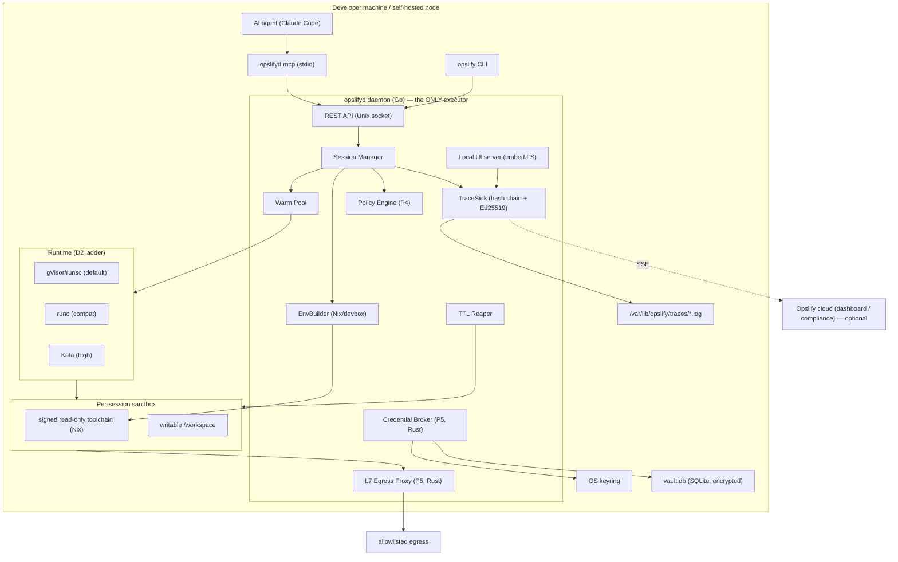
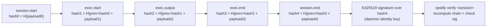
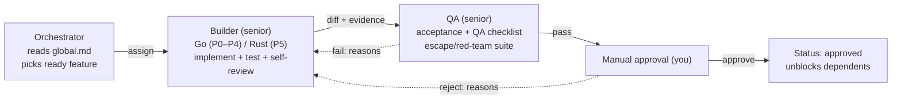

# Opslifyd — Architecture & Diagrams

All diagrams are Mermaid so agents can parse them. This is the shared mental model every agent must hold.

---

## 0. Repo layout (locked)

All Go code lives under **`daemon/`** so the repo root stays docs-first. Module path is `github.com/opslify-com/opslifyd`; the module root is `daemon/` (that's where `go.mod`/`go.sum` live). Run all `go` commands from `daemon/`; CI uses `working-directory: daemon`.

```
opslifyd/
├── spec/                # all docs & agent specs (goal/mission/architecture/phases/best-practices/tools)
├── .github/workflows/   # CI (validate + integration)
└── daemon/              # the Go module
    ├── go.mod  go.sum
    ├── cmd/{opslifyd,opslify}/     # daemon + CLI entrypoints
    └── internal/{env,session,trace,policy,broker,mcp}/
```
(P5 Rust components live under `daemon/` too, e.g. `daemon/broker-rs/`, `daemon/proxy-rs/`, when introduced.)

## 1. Stack (locked)

| Concern | Choice | Why |
|---|---|---|
| Primary language | **Go** | Ecosystem: gVisor, containerd, Podman bindings, cosign/sigstore, Dagger, official MCP SDK all Go |
| Secret-critical paths (P5) | **Rust** | Credential broker core + L7 egress proxy — memory-zeroing, safe plaintext-secret handling |
| Container engine | **Podman** (rootless) — containerd acceptable | Daemonless, rootless-by-default; strong security posture; no root Docker daemon |
| OCI runtime (default) | **gVisor / `runsc`** | Independent user-space kernel, no KVM needed, runs on laptops + cloud VMs |
| OCI runtime (compat) | **runc** | Fallback for tools gVisor breaks |
| OCI runtime (high, later) | **Kata**, then **Firecracker** (cloud tier) | microVM boundary; Firecracker needs KVM → cloud only |
| Env composer | **Nix + devbox** | Reproducible, content-addressed; `flake.lock` = SBOM/attestation |
| Image signing / SBOM | **cosign / sigstore**, **syft** | Signed, digest-pinned toolchains |
| Build & CI | **Dagger** | Reproducible pipelines in Go |
| MCP | **official Go SDK** (`modelcontextprotocol/go-sdk`) | Thin layer over stable internal API |
| Trace hashing / signing | **SHA-256 hash chain**, **Ed25519** signatures | Tamper-evident, offline-verifiable |
| Local UI | **Go `embed.FS` SPA + xterm.js**; TUI via **Bubble Tea** | Zero-install, localhost-only |
| Policy | **YAML + JSON-schema validation** (OPA/Rego optional later) | Simple, line-level errors first |
| Egress proxy (P5) | **Rust: hyper + rustls** | TLS terminate/pass-through, header injection |
| Local vault (P5) | **SQLite + age/NaCl**, key in OS keyring | Encrypted at rest, call-time injection only |
| Transport (daemon API) | **REST over Unix socket** `/run/opslify/opslifyd.sock` | Local, permissioned (0660, group `opslify`) |
| Cloud upstream (P3+) | **SSE** with offline buffering | Resume-from-acked-seq |

---

## 2. System overview



---

## 3. Session lifecycle

```mermaid
sequenceDiagram
    participant A as Agent (MCP)
    participant D as Daemon (executor)
    participant P as Policy (P4)
    participant R as Runtime (gVisor)
    participant S as Sandbox
    participant T as TraceSink
    participant B as Broker (P5)

    A->>D: session_create {mode, tier}
    D->>R: claim warm container + mount signed toolchain (RO) + /workspace (RW)
    D->>T: session.start (binds image_digest + toolchain_lock + policy_hash)
    A->>D: exec {argv}
    D->>P: check argv (allow / approval_required / deny)
    alt approval_required
        P-->>D: pause (awaiting_approval)
        D->>T: policy.decision pending
        Note over D: human approves in UI → resume, or timeout → auto-deny
    end
    alt cred needed (P5)
        D->>B: mint scoped short-lived token
        B-->>D: inject at spawn (env/header); zero memory after
        D->>T: cred.resolve {scope, ttl}
    end
    D->>S: spawn process (daemon is executor)
    S-->>D: stdout/stderr chunks + exit code
    D->>T: exec.output (redacted) + exec.end
    A->>D: session_end
    D->>R: destroy (scratch) / snapshot (workspace)
    D->>T: session.end + sign chain (Ed25519)
```

---

## 4. Tamper-evident trace chain



Any edit to any event breaks every downstream hash → `opslify verify` fails. Each session binds `image_digest + toolchain_lock_hash + policy_hash` → the compliance evidence pack (P6).

---

## 5. Agent build workflow



---

## 6. Shared interfaces (defined in P0, single impls first)

```go
// Runtime — isolation ladder (D2). Impls: RuncRuntime, GvisorRuntime, (KataRuntime, RemoteFirecracker later)
type Runtime interface {
    Create(ctx, SessionSpec) (ContainerHandle, error)
    Exec(ctx, ContainerHandle, ExecRequest) (ExecStream, error)
    Destroy(ctx, ContainerHandle) error
    Snapshot(ctx, ContainerHandle, name string) (ImageRef, error) // workspace mode
    Available() error // F0.3: capability probe (engine + OCI runtime present) so callers fall back down the ladder legibly
}

// EnvBuilder — Nix/devbox build-time composer (D1). Produces signed read-only toolchain.
type EnvBuilder interface {
    Compose(ctx, ToolSelection) (LockedEnv, error) // -> flake.lock + closure
    Bake(ctx, LockedEnv) (SignedLayer, error)      // -> cosign-signed, digest-pinned
    Verify(ctx, SignedLayer) error
}

// TraceSink — hash-chained, signed events. Impls: FileSink, then CloudSSESink.
type TraceSink interface {
    Emit(ctx, Event) error       // appends, computes prev_hash/hash
    Sign(ctx, sessionID) (Signature, error)
    Verify(ctx, sessionID) error
}

// SecretBackend — P5. Impls: LocalVault (default), later Vault/OpenBao/ASM.
type SecretBackend interface {
    Get(ref) (Secret, error); Put(ref, Secret) error; List() ([]Ref, error); Delete(ref) error
}
```

Rust P5 components (broker, proxy) speak to the Go daemon over **per-session mTLS gRPC**; the `SecretBackend` interface is the Go-side contract they satisfy via FFI or a local gRPC service.
